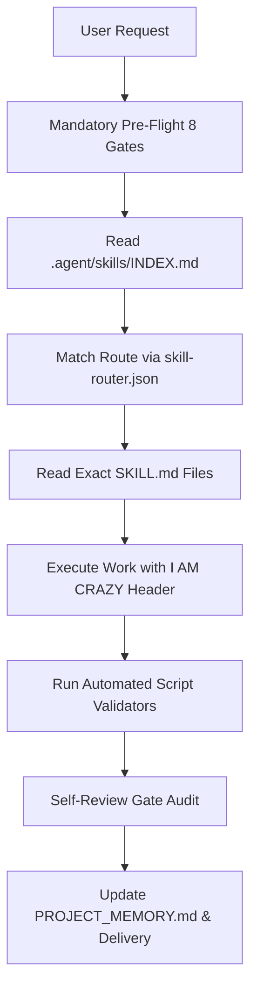

# PRD: Sistem Otak Tambahan AI & Red-Team Audit Engine (`.agent` Ecosystem)

> **Versi:** 3.0-ELITE  
> **Target System:** Repositori `folderotakgsap` (`rafihanja/yah-karya-online`)  
> **Tujuan Utama:** Menjamin 100% Skill, Rules, Validator Script, dan Governance Bridge di dalam folder `.agent` terpakai secara aktif, disiplin, tanpa orphan, dan tanpa celah bypass oleh seluruh AI Agent (Antigravity, Claude, Codex, Gemini, dll).

---

## 1. EXECUTIVE OVERVIEW & VISI ARSITEKTUR

Sistem `.agent` di repositori `folderotakgsap` didesain bukan sekadar sebagai kumpulan dokumentasi biasa, melainkan sebagai **"Extended Cortex / Otak Tambahan AI"**. 

Setiap AI Agent yang beroperasi di repositori ini dipaksa (*hard-gated*) untuk membaca arsitektur memori lokal, melakukan *skill routing* berbasis bukti, menjalankan *fail-closed governance*, serta mengeksekusi validasi otomatis sebelum menyerahkan hasil kerja ke pengguna.



---

## 2. SPESIFIKASI AUDIT 100% COVERAGE

Audit harus mencakup 6 pilar utama tanpa ada berkas yang terlewat:

### 2.1 Audit Skills (`.agent/skills/`)
- **Status Integrasi:** Setiap berkas `SKILL.md` dari 162+ skill wajib terdaftar di `.agent/skills/INDEX.md` dan terhubung ke pemicu (*when / routeWhen*) di `.agent/skill-router.json`.
- **Anti-Orphan Guarantee:** Tidak boleh ada skill "yatim piatu" yang ada di folder `.agent/skills/` tetapi tidak pernah dipanggil oleh router.
- **Kualitas Struktur Skill:** Setiap `SKILL.md` wajib memiliki:
  - Frontmatter YAML (`name`, `description`).
  - Section `ALWAYS DO THIS` dan `NEVER DO THIS` (dengan penjelasan penyebab kegagalan dan alternatif solusi).
  - Section `Validation Steps` dengan command terminal yang dapat dieksekusi.
  - Section `Sub-Agent Propagation` untuk meneruskan instruksi ke sub-agent.

### 2.2 Audit Governance & Rules (`.agent/rules/`)
- **7 Pilar Pre-Flight Compliance:**
  1. `session-boot` — Memaksa *header* `I AM CRAZY` di setiap output.
  2. `auto-pro-standards` — Injeksi otomatis OWASP Top 10, WCAG 2.2 AA, SEO, dan Core Web Vitals.
  3. `prompt-amplifier` — Tanya dulu (maks. 5 pertanyaan) jika prompt ambigu, jelaskan rencana, minta persetujuan.
  4. `phased-delivery` — Pembagian pekerjaan menjadi fase-fase kecil terukur.
  5. `project-memory` — Penulisan dan pembacaan `PROJECT_MEMORY.md` anti-amnesia.
  6. `self-review-gate` — Internal quality audit sebelum delivery.
  7. `mandatory-skill-usage` — Larangan keras menjawab dari ingatan tanpa membaca berkas `SKILL.md`.
- **Fail-Closed Governance (`fail-closed-governance.md`):** Pelanggaran gate adalah *hard failure*. Agent wajib berhenti, menulis `GOVERNANCE VIOLATION DETECTED`, melakukan rollback, dan rerun validation.

### 2.3 Audit Official Reference Map (`.agent/official-reference-map.json`)
- Memastikan 33 topik teknologi kanonis (HTML, CSS, JS, React, Python, Next.js, Git, SQL, dll) terhubung ke sumber dokumentasi resmi.
- Memaksa pencatatan koreksi user ke `.agent/memory/lessons-learned.md`.

### 2.4 Audit Script Validators (`.agent/scripts/`)
Setiap script penguji internal wajib lolos dengan exit code `0`:
1. `node .agent/scripts/generate-skill-index.mjs` — Regenerasi katalog skill.
2. `node .agent/scripts/validate-agent-skills.mjs` — Validasi struktur & sintaks seluruh skill.
3. `node .agent/scripts/agent-doctor.mjs` — Deteksi orphan skills, broken references, dan rute menggantung.
4. `node .agent/scripts/deep-skill-audit.mjs` — Audit mendalam kualitas isi skill.
5. `node .agent/scripts/self-review-validator.mjs --scope agent` — Audit integritas tata kelola agent.

### 2.5 Audit Multi-Agent Bridge (`AGENTS.md`, `CLAUDE.md`)
- Memastikan jembatan aturan disinkronkan secara otomatis dari `.agent/rules/`.
- Menjamin sub-agent yang didispatch membawa perintah `SUB-AGENT PROPAGATION` lengkap.

---

## 3. METRIK KEBERHASILAN & ZERO-TOLERANCE KPI

- **Orphan Skills Rate:** 0% (Semua skill terhubung ke router).
- **Broken References:** 0 (Tidak ada tautan berkas yang hilang).
- **Validation Exit Code:** Must be `0` across all validator scripts.
- **Strict Header Enforcement:** 100% output agent dimulai dengan header `I AM CRAZY`.

---

# MASTER PROMPT AUDIT & INSTRUKSI EKSEKUSI AGENT

Gunakan prompt di bawah ini untuk memerintahkan AI Agent manapun (Antigravity, Claude CLI, Codex, Gemini) melakukan audit total dan pembenahan sistem otak AI di repositori ini:

```text
================================================================================
🚨 MASTER AUDIT DIRECTIVE: FULL REPOSITORY SYSTEM & SKILL GOVERNANCE AUDIT
================================================================================

TUGAS UTAMA:
Anda diperintahkan untuk melakukan RED-TEAM AUDIT & SYSTEM ALIGNMENT secara menyeluruh pada repositori `folderotakgsap` (.agent ecosystem). Pastikan SELURUH skill (162+ skill), aturan (rules), router, validator script, dan bridge digunakan 100% secara aktif sebagai "Otak Tambahan AI" tanpa ada celah, orphan skill, atau bypass governance.

JALANKAN AUDIT DENGAN PROTOKOL STRICT 6 LANGKAH BERIKUT:

--------------------------------------------------------------------------------
LANGKAH 1: PRE-FLIGHT READ & HEADER DISCLOSURE (WAJIB)
--------------------------------------------------------------------------------
Sebelum melakukan analisis atau mengedit berkas, Anda WAJIB membaca 7 berkas governance berurutan menggunakan tool pembaca berkas (view_file):
1. .agent/skills/session-boot/SKILL.md
2. .agent/skills/auto-pro-standards/SKILL.md
3. .agent/skills/prompt-amplifier/SKILL.md
4. .agent/skills/phased-delivery/SKILL.md
5. .agent/skills/project-memory/SKILL.md
6. .agent/skills/self-review-gate/SKILL.md
7. .agent/rules/mandatory-skill-usage.md
8. PROJECT_MEMORY.md

Mulai output Anda dengan I AM CRAZY header block lengkap!

--------------------------------------------------------------------------------
LANGKAH 2: EKSEKUSI ENGINE VALIDATOR AUTOMATION
--------------------------------------------------------------------------------
Jalankan perintah-perintah validator terminal berikut dan tangkap seluruh outputnya:
1. node .agent/scripts/generate-skill-index.mjs
2. node .agent/scripts/validate-agent-skills.mjs
3. node .agent/scripts/agent-doctor.mjs
4. node .agent/scripts/deep-skill-audit.mjs
5. node .agent/scripts/audit-skill-quality.mjs
6. node .agent/scripts/self-review-validator.mjs --scope agent

Jika ada script yang memberikan exit code non-zero, peringatan "orphan skill", "broken reference", atau "missing mandatory section", CATAT SEBAGAI DEFECT/CELAH.

--------------------------------------------------------------------------------
LANGKAH 3: AUDIT STRUKTUR SKILL & ROUTER ALIGNMENT (100% COVERAGE)
--------------------------------------------------------------------------------
Periksa keselarasan antara:
- .agent/skills/ (Katalog berkas SKILL.md)
- .agent/skills/INDEX.md (Index lengkap)
- .agent/skill-router.json (Aturan pemicu routing)
- .agent/active-skills.json (Daftar skill aktif & on-demand bundles)

Pastikan:
a) 100% skill memiliki deskripsi, ALWAYS DO THIS, NEVER DO THIS, dan Validation Steps.
b) Tidak ada skill yatim piatu (orphan skills) yang ada di folder tapi tidak terdaftar di skill-router.json.
c) Setiap rute pemicu di skill-router.json menunjuk ke berkas SKILL.md yang benar-benar ada.

--------------------------------------------------------------------------------
LANGKAH 4: AUDIT INTEGRITAS GOVERNANCE & BRIDGE
--------------------------------------------------------------------------------
Periksa berkas AGENTS.md dan CLAUDE.md. Pastikan:
a) Semua aturan fail-closed governance, I AM CRAZY header, dan 7 pilar pre-flight sudah disinkronkan ke AGENTS.md.
b) Instruksi SUB-AGENT PROPAGATION ada dan jelas.
c) Aturan official-reference verification (.agent/official-reference-map.json) dan pencatatan pelajaran (.agent/memory/lessons-learned.md) aktif.

--------------------------------------------------------------------------------
LANGKAH 5: REPAIR & REMEDIATION (JIKA DITEMUKAN DEFECT)
--------------------------------------------------------------------------------
Jika menemukan celah, orphan skill, broken reference, atau dokumen stale:
1. Perbaiki berkas SKILL.md / router / script / bridge yang bermasalah.
2. Jalankan ulang seluruh validator script hingga 100% EXIT CODE 0 dan ZERO WARNINGS.
3. Update PROJECT_MEMORY.md dengan hasil audit terbaru.

--------------------------------------------------------------------------------
LANGKAH 6: LAPORAN AUDIT KHUSUS & REKAPITULASI
--------------------------------------------------------------------------------
Sajikan Laporan Audit Kompleks dengan format:
1. Header I AM CRAZY.
2. Rekapitulasi Skor Kesehatan Sistem .agent (0-100%).
3. Tabel Hasil Audit 6 Script Validator.
4. Temuan Celah & Tindakan Perbaikan (jika ada).
5. Bukti Eksekusi Terminal & Matriks Integrity.
================================================================================
```
